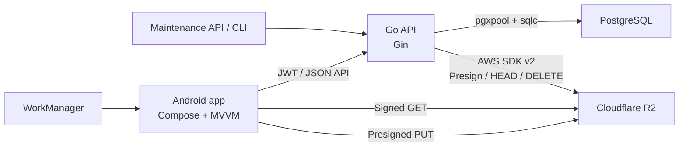

# Kiến trúc tổng thể

## Mục tiêu

Photo Map là private cloud gallery cho ảnh và video. Backend không nhận hoặc lưu file media trên filesystem. Android upload trực tiếp tới Cloudflare R2 bằng presigned URL; PostgreSQL chỉ lưu metadata, trạng thái đồng bộ và quan hệ nghiệp vụ.

## Sơ đồ hệ thống



## Thành phần

### Android

- Jetpack Compose cho auth, gallery, search, albums, asset detail và settings.
- MVVM với `StateFlow` cho UI state.
- Retrofit/OkHttp gọi backend; base URL mặc định đến từ `BuildConfig` và có thể đổi ở runtime bằng cấu hình custom server.
- Coil tải và cache thumbnail/preview qua signed URL với cache key ổn định theo asset/variant.
- MediaStore scanner đọc ảnh/video và metadata.
- Room giữ `local_assets`, remote asset replica, change-feed cursor và metadata mutation queue.
- WorkManager chạy upload, periodic scan, metadata push và offline image prefetch.
- Upload song song theo asset, mặc định 8, dùng preset 8/16/32/64/128 và có thể pause độc lập với periodic scan.
- Background upload mặc định tắt; Wi-Fi only mặc định bật.
- Asset detail đọc Room trước, hỗ trợ swipe, preview zoom, load/download original theo yêu cầu.

### Backend

- `cmd/api`: HTTP server, graceful shutdown, route registration.
- `internal/handler`: bind/validate HTTP request và map lỗi.
- `internal/service`: auth, upload, asset, album và maintenance rules.
- `internal/db/sqlc`: typed query layer trên pgxpool.
- `internal/storage`: Cloudflare R2 adapter dùng AWS SDK Go v2.
- `migrations`: schema PostgreSQL do golang-migrate quản lý.

### Storage và database

- R2 giữ original, thumbnail, preview và poster frame.
- PostgreSQL giữ user, device, asset metadata, upload session, album và audit.
- `assets(user_id, checksum_sha256)` chống trùng nội dung trong cùng user.
- `device_assets(user_id, device_id, local_asset_id)` chống upload lặp từ cùng thiết bị.

## Trust boundaries

- Mọi API riêng tư yêu cầu JWT; JWT chứa `sub`, `email`, `iat`, `exp`.
- Mọi query asset, album, device và upload session phải scope theo `user_id`.
- R2 credential chỉ tồn tại ở backend. Android chỉ nhận presigned URL có thời hạn.
- Maintenance endpoint yêu cầu email JWT thuộc `ADMIN_EMAILS`.
- Hard delete chỉ xóa DB sau khi xóa R2 thành công.
- Custom backend chỉ chấp nhận HTTPS hoặc HTTP tới localhost/private IP. Đổi backend hủy worker, logout và xóa state gắn với server cũ.

## Luồng dữ liệu chính

1. Android đăng nhập, lưu JWT an toàn và đăng ký device.
2. MediaStore scan ghi media mới vào Room với trạng thái `pending`.
3. Worker tính SHA-256 và tạo hoặc resume upload session.
4. Android PUT trực tiếp các object vào R2.
5. Backend `HEAD` original, tạo hoặc tái sử dụng asset trong transaction.
6. Android replicate metadata qua `GET /assets/changes`, commit snapshot và cursor cùng transaction rồi render gallery từ Room.
7. Favorite/archive/trash/restore/hard-delete được ghi vào local pending queue, push lên backend và reconcile lại bằng change feed.
8. Coil cache thumbnail/preview; original chỉ được tải tạm hoặc stream tới URI do người dùng chọn.
9. Maintenance cleanup xử lý object của session hết hạn nhưng chưa tạo asset.

## Cấu trúc repository

```text
photo-map-app/
  android/                 Android application
  backend/
    cmd/api/               HTTP API entrypoint
    cmd/maintenance/       Maintenance CLI
    internal/              Backend implementation
    migrations/            PostgreSQL migrations
    sql/queries.sql        sqlc query source
  docs/                    Architecture and contracts
```
