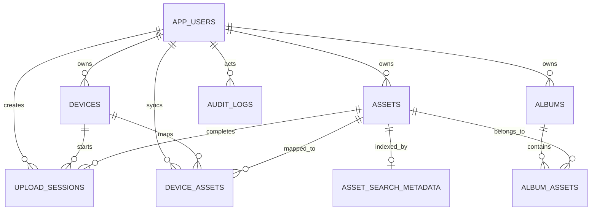

# Database schema

## Nguồn chuẩn

DDL thực thi chính thức nằm trong `backend/migrations`. File này là bản mô tả hợp nhất của migrations `000001` đến `000003`; mọi thay đổi schema mới vẫn phải được tạo thành migration mới.

## Quan hệ



## DDL PostgreSQL

```sql
CREATE EXTENSION IF NOT EXISTS pgcrypto;

CREATE FUNCTION set_updated_at()
RETURNS TRIGGER AS $$
BEGIN
  NEW.updated_at = now();
  RETURN NEW;
END;
$$ LANGUAGE plpgsql;

CREATE TABLE app_users (
  id UUID PRIMARY KEY DEFAULT gen_random_uuid(),
  email TEXT UNIQUE NOT NULL,
  password_hash TEXT NOT NULL,
  display_name TEXT,
  created_at TIMESTAMPTZ DEFAULT now(),
  updated_at TIMESTAMPTZ DEFAULT now()
);

CREATE TABLE devices (
  id UUID PRIMARY KEY DEFAULT gen_random_uuid(),
  user_id UUID NOT NULL REFERENCES app_users(id) ON DELETE CASCADE,
  device_name TEXT,
  platform TEXT NOT NULL,
  device_fingerprint TEXT NOT NULL,
  last_seen_at TIMESTAMPTZ,
  created_at TIMESTAMPTZ DEFAULT now(),
  updated_at TIMESTAMPTZ DEFAULT now(),
  UNIQUE (user_id, device_fingerprint)
);

CREATE TABLE assets (
  id UUID PRIMARY KEY DEFAULT gen_random_uuid(),
  user_id UUID NOT NULL REFERENCES app_users(id) ON DELETE CASCADE,
  storage_provider TEXT DEFAULT 'cloudflare_r2',
  bucket TEXT NOT NULL,
  object_key TEXT NOT NULL,
  thumbnail_key TEXT,
  preview_key TEXT,
  poster_frame_key TEXT,
  media_type TEXT NOT NULL CHECK (media_type IN ('image', 'video')),
  mime_type TEXT NOT NULL,
  original_filename TEXT,
  file_size_bytes BIGINT NOT NULL,
  checksum_sha256 CHAR(64) NOT NULL,
  perceptual_hash TEXT,
  taken_at TIMESTAMPTZ,
  taken_at_source TEXT,
  timezone_offset_minutes SMALLINT,
  width INT,
  height INT,
  orientation SMALLINT,
  duration_ms BIGINT,
  latitude DOUBLE PRECISION,
  longitude DOUBLE PRECISION,
  country TEXT,
  region TEXT,
  city TEXT,
  place_name TEXT,
  camera_make TEXT,
  camera_model TEXT,
  software TEXT,
  blurhash TEXT,
  dominant_color TEXT,
  is_favorite BOOLEAN DEFAULT false,
  is_archived BOOLEAN DEFAULT false,
  is_hidden BOOLEAN DEFAULT false,
  is_trashed BOOLEAN DEFAULT false,
  trashed_at TIMESTAMPTZ,
  uploaded_at TIMESTAMPTZ DEFAULT now(),
  created_at TIMESTAMPTZ DEFAULT now(),
  updated_at TIMESTAMPTZ DEFAULT now(),
  UNIQUE (user_id, object_key),
  UNIQUE (user_id, checksum_sha256)
);

CREATE TABLE upload_sessions (
  id UUID PRIMARY KEY DEFAULT gen_random_uuid(),
  user_id UUID NOT NULL REFERENCES app_users(id) ON DELETE CASCADE,
  device_id UUID REFERENCES devices(id) ON DELETE SET NULL,
  local_asset_id TEXT,
  object_key TEXT NOT NULL,
  thumbnail_key TEXT,
  preview_key TEXT,
  poster_frame_key TEXT,
  bucket TEXT NOT NULL,
  media_type TEXT NOT NULL CHECK (media_type IN ('image', 'video')),
  mime_type TEXT NOT NULL,
  original_filename TEXT,
  file_size_bytes BIGINT,
  expected_checksum_sha256 CHAR(64),
  status TEXT NOT NULL CHECK (status IN
    ('created', 'uploading', 'uploaded', 'processing', 'completed', 'failed', 'expired')),
  asset_id UUID REFERENCES assets(id) ON DELETE SET NULL,
  error_message TEXT,
  expires_at TIMESTAMPTZ NOT NULL,
  completed_at TIMESTAMPTZ,
  created_at TIMESTAMPTZ DEFAULT now(),
  updated_at TIMESTAMPTZ DEFAULT now()
);

CREATE TABLE device_assets (
  id UUID PRIMARY KEY DEFAULT gen_random_uuid(),
  user_id UUID NOT NULL REFERENCES app_users(id) ON DELETE CASCADE,
  device_id UUID NOT NULL REFERENCES devices(id) ON DELETE CASCADE,
  asset_id UUID REFERENCES assets(id) ON DELETE SET NULL,
  local_asset_id TEXT NOT NULL,
  local_uri TEXT,
  local_created_at TIMESTAMPTZ,
  local_modified_at TIMESTAMPTZ,
  sync_status TEXT NOT NULL,
  last_error TEXT,
  last_synced_at TIMESTAMPTZ,
  created_at TIMESTAMPTZ DEFAULT now(),
  updated_at TIMESTAMPTZ DEFAULT now(),
  UNIQUE (user_id, device_id, local_asset_id)
);

CREATE TABLE albums (
  id UUID PRIMARY KEY DEFAULT gen_random_uuid(),
  user_id UUID NOT NULL REFERENCES app_users(id) ON DELETE CASCADE,
  name TEXT NOT NULL,
  description TEXT,
  cover_asset_id UUID REFERENCES assets(id) ON DELETE SET NULL,
  is_archived BOOLEAN DEFAULT false,
  created_at TIMESTAMPTZ DEFAULT now(),
  updated_at TIMESTAMPTZ DEFAULT now()
);

CREATE TABLE album_assets (
  album_id UUID NOT NULL REFERENCES albums(id) ON DELETE CASCADE,
  asset_id UUID NOT NULL REFERENCES assets(id) ON DELETE CASCADE,
  added_at TIMESTAMPTZ DEFAULT now(),
  sort_order BIGINT,
  PRIMARY KEY (album_id, asset_id)
);

CREATE TABLE asset_search_metadata (
  asset_id UUID PRIMARY KEY REFERENCES assets(id) ON DELETE CASCADE,
  labels_json JSONB DEFAULT '[]'::jsonb,
  labels_text TEXT,
  ocr_text TEXT,
  ai_caption TEXT,
  search_vector TSVECTOR GENERATED ALWAYS AS (
    setweight(to_tsvector('english', coalesce(labels_text, '')), 'A') ||
    setweight(to_tsvector('english', coalesce(ocr_text, '')), 'B') ||
    setweight(to_tsvector('english', coalesce(ai_caption, '')), 'C')
  ) STORED,
  created_at TIMESTAMPTZ DEFAULT now(),
  updated_at TIMESTAMPTZ DEFAULT now()
);

CREATE TABLE audit_logs (
  id UUID PRIMARY KEY DEFAULT gen_random_uuid(),
  user_id UUID REFERENCES app_users(id) ON DELETE SET NULL,
  action TEXT NOT NULL,
  entity_type TEXT,
  entity_id UUID,
  metadata JSONB,
  created_at TIMESTAMPTZ NOT NULL DEFAULT now()
);
```

## Index và invariant quan trọng

```sql
CREATE INDEX assets_timeline_idx
  ON assets (user_id, taken_at DESC, id DESC) WHERE is_trashed = false;
CREATE INDEX assets_media_type_timeline_idx
  ON assets (user_id, media_type, taken_at DESC) WHERE is_trashed = false;
CREATE INDEX assets_favorites_idx
  ON assets (user_id, taken_at DESC) WHERE is_favorite = true AND is_trashed = false;
CREATE INDEX assets_trash_idx
  ON assets (user_id, trashed_at DESC) WHERE is_trashed = true;
CREATE INDEX assets_city_timeline_idx
  ON assets (user_id, city, taken_at DESC) WHERE city IS NOT NULL AND is_trashed = false;
CREATE INDEX devices_user_id_idx ON devices (user_id);
CREATE INDEX device_assets_user_device_idx ON device_assets (user_id, device_id);
CREATE INDEX albums_user_created_at_idx ON albums (user_id, created_at DESC);
CREATE INDEX album_assets_asset_id_idx ON album_assets (asset_id);
CREATE INDEX asset_search_metadata_vector_idx
  ON asset_search_metadata USING GIN (search_vector);
CREATE UNIQUE INDEX upload_sessions_user_object_key_uidx
  ON upload_sessions (user_id, object_key);
CREATE INDEX idx_upload_sessions_user_device_local_status
  ON upload_sessions (user_id, device_id, local_asset_id, status, expires_at DESC);
CREATE INDEX audit_logs_action_created_at_idx
  ON audit_logs (action, created_at DESC);

CREATE TRIGGER app_users_set_updated_at BEFORE UPDATE ON app_users
  FOR EACH ROW EXECUTE FUNCTION set_updated_at();
CREATE TRIGGER devices_set_updated_at BEFORE UPDATE ON devices
  FOR EACH ROW EXECUTE FUNCTION set_updated_at();
CREATE TRIGGER assets_set_updated_at BEFORE UPDATE ON assets
  FOR EACH ROW EXECUTE FUNCTION set_updated_at();
CREATE TRIGGER upload_sessions_set_updated_at BEFORE UPDATE ON upload_sessions
  FOR EACH ROW EXECUTE FUNCTION set_updated_at();
CREATE TRIGGER device_assets_set_updated_at BEFORE UPDATE ON device_assets
  FOR EACH ROW EXECUTE FUNCTION set_updated_at();
CREATE TRIGGER albums_set_updated_at BEFORE UPDATE ON albums
  FOR EACH ROW EXECUTE FUNCTION set_updated_at();
CREATE TRIGGER asset_search_metadata_set_updated_at BEFORE UPDATE ON asset_search_metadata
  FOR EACH ROW EXECUTE FUNCTION set_updated_at();
```

- `assets(user_id, checksum_sha256)` là content-level idempotency key.
- `device_assets(user_id, device_id, local_asset_id)` là device-level idempotency key.
- Không được xóa object R2 nếu key xuất hiện trong bất kỳ cột object key nào của `assets`.
- Trigger `set_updated_at` cập nhật `updated_at` cho các bảng mutable.
