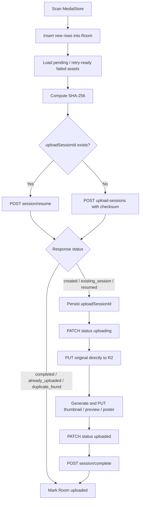

# Android sync flow

## Local state

Room table `local_assets` lưu:

| Field | Mục đích |
|---|---|
| `localAssetId` | Stable MediaStore identity, primary key |
| `uri` | Content URI; original được stream trực tiếp từ đây |
| `mediaType`, `mimeType`, `displayName`, `sizeBytes` | Upload session input |
| `width`, `height`, `durationMs`, `takenAt`, `modifiedAt` | Metadata cơ bản |
| `syncStatus` | `pending`, `uploading`, `uploaded`, `failed`, `skipped` |
| `uploadSessionId` | Session dùng để resume sau process death |
| `uploadAttemptCount`, `nextRetryAt`, `lastError` | Retry state |
| `remoteAssetId`, `lastSyncedAt` | Kết quả backend đã xác nhận |

## Scheduling

- Manual sync: scan MediaStore rồi enqueue unique work `media-sync`.
- Background sync: periodic worker `periodic-media-scan`, chu kỳ 1 giờ, best-effort.
- Upload work là unique work nên không có hai queue chạy chồng nhau.
- `wifiOnly=true` dùng `NetworkType.UNMETERED`; nếu tắt dùng `CONNECTED`.
- WorkManager exponential backoff bắt đầu từ 30 giây.
- Logout hủy cả upload work và periodic work.

## Upload flow

Mỗi worker đọc `maxParallelUploads` khi bắt đầu. Tối đa 1-16 asset được xử lý đồng thời; các variant trong một asset được upload tuần tự. Original luôn được stream từ MediaStore, không ghi file tạm.

## Metadata

Scanner/extractor đọc MediaStore ID, filename, MIME type, size, timestamps, dimensions và duration. EXIF bổ sung DateTimeOriginal, GPS, orientation, make, model và software. Complete request gửi metadata có sẵn; derivative thiếu không chặn việc tạo asset nếu original đã tồn tại.

## Retry và resume

1. Khi worker khởi động, row mắc ở `uploading` được reset về `pending`.
2. Nếu Room có `uploadSessionId`, worker gọi resume và tái sử dụng object keys.
3. Presigned PUT trả `403`: gọi resume để lấy fresh URL rồi thử lại.
4. Resume trả `403`, `404` hoặc `409`: clear `uploadSessionId`, đánh dấu failed và lần sau tạo session mới.
5. Network failure: lưu lỗi, `nextRetryAt`, trả `Result.retry()`.
6. HTTP `401`: xóa auth local và dừng queue, không complete bằng token cũ.
7. `CancellationException` luôn được propagate, không bị đổi thành failed upload.
8. Một asset lỗi không hủy các asset song song khác vì batch dùng supervisor semantics.

Chỉ các response `completed`, `already_uploaded`, `duplicate_found` hoặc complete thành công mới được phép chuyển Room sang `uploaded`.

## Foreground execution

Upload worker chạy foreground với notification channel `media_uploads`, hiển thị số file đã xử lý. Manifest khai báo `FOREGROUND_SERVICE`, `FOREGROUND_SERVICE_DATA_SYNC` và service type `dataSync`. Android 13+ có `POST_NOTIFICATIONS`; từ chối quyền notification không làm thay đổi tính đúng đắn của sync.

## UI recovery

- Login/register cho phép submit lại sau lỗi.
- Gallery dùng Paging 3 cursor pagination, pull-to-refresh và retry riêng cho initial/append errors.
- Gallery hiển thị offline banner nhưng giữ các item đã load và refresh khi app quay lại foreground.
- Gallery có quick filters All/Photos/Videos/Favorites và menu chuyển Main/Archive/Trash.
- Signed thumbnail/preview URL chỉ tồn tại trong page hiện tại; refresh lấy URL mới khi URL cũ hết hạn.
- Asset detail hỗ trợ favorite, archive, trash, restore và cloud hard delete có confirmation dialog.
- Mutation thành công invalidate gallery Pager; hard delete không xóa file MediaStore cục bộ.
- Settings hiển thị số pending/uploading/uploaded/failed, manual sync và retry failed.

## Gallery organization

- The main gallery inserts non-sticky date headers into Paging 3 data without changing backend ordering.
- Date labels use `Today`, `Yesterday`, a localized medium date, or `Date unknown` when `takenAt` is missing or invalid.
- Search debounces non-blank queries and pages results from `GET /search`; blank queries never call the backend.
- Albums support list, create, edit, delete, asset selection, and remove-from-album actions.
- Album deletion and remove-from-album only change album membership. They never delete cloud assets or local MediaStore files.
- Asset detail can add an asset to an existing album. Duplicate membership is treated as an idempotent backend no-op.
- Search and album thumbnails use signed URLs returned by the backend; the Android client never constructs R2 URLs.

## Gallery multi-select and sync awareness

- Long-press enters selection mode. Stable cloud asset IDs are the only selection keys.
- Favorite, archive, trash, and add-to-album actions reuse the existing single-asset APIs.
- Client-side batch execution is bounded to four concurrent requests. The backend does not expose batch mutation APIs yet.
- A partial batch keeps failed asset IDs selected, reports succeeded/failed counts, and allows retry.
- Bulk hard delete is intentionally not available.
- The gallery sync banner reads pending, uploading, and failed counts from Room. Start sync and retry use the existing WorkManager flow.
- Changes to Room's uploaded count trigger a gallery refresh. App resume remains a safe fallback and does not poll continuously.
- Unsynced local media is not merged into the remote cloud grid, and upload completion rules are unchanged.
- A jump-to-top button is shown after scrolling down. A full month fast scroller remains future work.

## Single photo viewer

- Gallery/search/album grids use `thumbnailUrl`; the photo detail viewer requests `variant=preview` from the backend.
- The viewer never constructs an R2 URL and never stores a signed read URL in Room, preferences, or saved instance state.
- Pinch zoom is clamped from 1x to 5x. Double tap toggles approximately 2.5x and reset; pan offsets are clamped to the scaled container.
- Zoom survives ordinary recomposition and resets when the asset or intentionally refreshed image URL changes.
- A failed Coil load shows an explicit retry action. Retry requests a fresh signed URL instead of modifying URL query parameters.
- `variant=original` is available through the repository but is not loaded by default to avoid unnecessary memory pressure.
- Video detail remains separate from the zoomable photo viewer and currently shows a preview with a playback-unavailable state.
