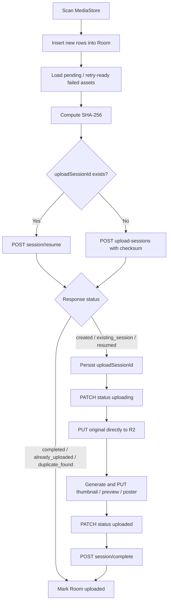

# Android sync flow

## Local state

Room table `local_assets` lưu:

| Field | Mục đích |
|---|---|
| `localAssetId` | Stable MediaStore identity, primary key |
| `uri` | Content URI; original được stream trực tiếp từ đây |
| `mediaType`, `mimeType`, `displayName`, `sizeBytes` | Upload session input |
| `width`, `height`, `durationMs`, `takenAt`, `modifiedAt` | Metadata cơ bản |
| `syncStatus` | `pending`, `uploading`, `uploaded`, `failed`, `skipped` |
| `uploadSessionId` | Session dùng để resume sau process death |
| `uploadAttemptCount`, `nextRetryAt`, `lastError` | Retry state |
| `remoteAssetId`, `lastSyncedAt` | Kết quả backend đã xác nhận |

## Scheduling

- Manual sync: scan MediaStore rồi enqueue unique work `media-sync`.
- Background sync mặc định tắt. Khi bật, periodic worker `periodic-media-scan` chạy mỗi 1 giờ theo best-effort.
- Upload work là unique work nên không có hai queue chạy chồng nhau.
- `wifiOnly=true` dùng `NetworkType.UNMETERED`; nếu tắt dùng `CONNECTED`.
- WorkManager exponential backoff bắt đầu từ 30 giây.
- `Pause uploads` hủy `media-sync` và chặn enqueue mới; periodic scan vẫn có thể cập nhật Room. Resume enqueue worker mới ngay.
- Logout hủy cả upload work và periodic work.

## Upload flow

Mỗi worker đọc `maxParallelUploads` khi bắt đầu. Giá trị mặc định là 8, các preset hợp lệ là 8/16/32/64/128 và batch tối đa là 128 asset. Các variant trong một asset được upload tuần tự. Original luôn được stream từ MediaStore, không ghi file tạm.

## Metadata

Scanner/extractor đọc MediaStore ID, filename, MIME type, size, timestamps, dimensions và duration. EXIF bổ sung DateTimeOriginal, GPS, orientation, make, model và software. Complete request gửi metadata có sẵn; derivative thiếu không chặn việc tạo asset nếu original đã tồn tại.

## Retry và resume

1. Khi worker khởi động, row mắc ở `uploading` được reset về `pending`.
2. Nếu Room có `uploadSessionId`, worker gọi resume và tái sử dụng object keys.
3. Presigned PUT trả `403`: gọi resume để lấy fresh URL rồi thử lại.
4. Resume trả `403`, `404` hoặc `409`: clear `uploadSessionId`, đánh dấu failed và lần sau tạo session mới.
5. Network failure: lưu lỗi, `nextRetryAt`, trả `Result.retry()`.
6. HTTP `401`: xóa auth local và dừng queue, không complete bằng token cũ.
7. `CancellationException` luôn được propagate, không bị đổi thành failed upload.
8. Một asset lỗi không hủy các asset song song khác vì batch dùng supervisor semantics.

Chỉ các response `completed`, `already_uploaded`, `duplicate_found` hoặc complete thành công mới được phép chuyển Room sang `uploaded`.

### Existing asset metadata backfill

- Android requests optional `ACCESS_MEDIA_LOCATION`; gallery access remains usable when it is denied.
- Android 10+ reads image EXIF through `MediaStore.setRequireOriginal`. Video date/location comes from `MediaMetadataRetriever`.
- Unique foreground work `asset-metadata-backfill` processes uploaded local rows that have a `remoteAssetId` and pending backfill state.
- Each item sends only `PUT /assets/{id}/metadata`. It never creates an upload session or uploads media to R2.
- Completed rows are not scanned again. Missing local media and missing cloud assets are marked skipped; network/server failures remain retryable.
- After successful updates, `/assets/changes` reconciles `remote_assets`, including GPS, EXIF source, timezone and software.
- Settings displays permission, progress, pending/failed counts and a retry action. Logout or backend switching cancels the worker.

## Foreground execution

Upload worker chạy foreground với notification channel `media_uploads`, hiển thị số file đã xử lý. Manifest khai báo `FOREGROUND_SERVICE`, `FOREGROUND_SERVICE_DATA_SYNC` và service type `dataSync`. Android 13+ có `POST_NOTIFICATIONS`; từ chối quyền notification không làm thay đổi tính đúng đắn của sync.

## UI recovery

Cloud gallery metadata uses a separate local replica:

- `remote_assets` stores server metadata and temporary signed read URLs. It never stores media binary or filesystem paths.
- `remote_sync_state` stores the last committed `asset_changes.change_id` cursor under id `asset_metadata`.
- Gallery observes `remote_assets` through Room. Retrofit responses are applied transactionally and are never rendered directly.
- Each change-feed page applies upsert/trash/restore/delete operations and advances the cursor in the same Room transaction.
- A failed refresh preserves cached rows and shows a non-blocking error. Normal logout clears remote replica/sync state but preserves `local_assets`.
- `GET /assets` pagination is no longer the source for the main gallery; cloud replication uses `GET /assets/changes` exclusively.

## Cloud metadata mutation queue

- `remote_asset_pending_ops` persists favorite, archive, trash, restore, and hard-delete operations independently from upload state.
- UI mutations optimistically update `remote_assets` and enqueue unique WorkManager work constrained to a connected network.
- Favorite/archive keep only the latest requested value. Trash/restore keep the latest transition. Hard delete supersedes all older active operations for that asset.
- The metadata worker sends operations sequentially, applies exponential retry state, and then runs `GET /assets/changes` so the server change log confirms final Room state.
- HTTP 401 preserves pending operations and clears the expired session. HTTP 404 is considered complete only after cloud sync removes the local replica row.
- Settings retry covers failed uploads and failed metadata operations. Logout cancels metadata work and clears pending operations.

- Login/register cho phép submit lại sau lỗi.
- Gallery giữ giao diện Paging 3 nhưng dữ liệu chính được phát từ Room; pull-to-refresh chạy change-feed sync.
- Gallery hiển thị offline banner và giữ các item đã cache; quay lại từ Asset Detail không refresh Paging hoặc reset vị trí scroll.
- Gallery có quick filters All/Photos/Videos/Favorites và menu chuyển Main/Archive/Trash.
- Signed thumbnail/preview URL được cache tạm trong `remote_assets`; metadata sync thay thế URL khi backend phát snapshot mới.
- Coil chỉ yêu cầu URL mới khi lỗi tải chứa HTTP 403. Lỗi offline hoặc decode không xóa metadata và không tạo refresh request.
- URL refresh được deduplicate theo `assetId + variant`; Room chỉ cập nhật cột URL và freshness timestamp, sau đó emission mới khiến Coil tự retry.
- Gallery ưu tiên thumbnail và dùng preview khi thumbnail URL không tồn tại. Backend `read-url` vẫn là nguồn duy nhất tạo URL; Android không tự dựng URL R2.
- Asset detail hỗ trợ favorite, archive, trash, restore và cloud hard delete có confirmation dialog.
- Mutation thành công invalidate gallery Pager; hard delete không xóa file MediaStore cục bộ.
- Settings hiển thị số pending/uploading/uploaded/failed, manual sync và retry failed.

## Gallery organization

- The main gallery inserts non-sticky date headers into Paging 3 data without changing backend ordering.
- Date labels use `Today`, `Yesterday`, a localized medium date, or `Date unknown` when `takenAt` is missing or invalid.
- Search debounces non-blank queries and pages results from `GET /search`; blank queries never call the backend.
- Albums support list, create, edit, delete, asset selection, and remove-from-album actions.
- Album deletion and remove-from-album only change album membership. They never delete cloud assets or local MediaStore files.
- Asset detail can add an asset to an existing album. Duplicate membership is treated as an idempotent backend no-op.
- Search and album thumbnails use signed URLs returned by the backend; the Android client never constructs R2 URLs.

## Gallery multi-select and sync awareness

- Long-press enters selection mode. Stable cloud asset IDs are the only selection keys.
- Favorite, archive, trash, and add-to-album actions reuse the existing single-asset APIs.
- Client-side batch execution is bounded to four concurrent requests. The backend does not expose batch mutation APIs yet.
- A partial batch keeps failed asset IDs selected, reports succeeded/failed counts, and allows retry.
- Bulk hard delete is intentionally not available.
- The gallery sync banner reads pending, uploading, and failed counts from Room. Start sync and retry use the existing WorkManager flow.
- Changes to Room's uploaded count trigger metadata sync. Gallery does not refresh Paging merely because its navigation destination resumes.
- Unsynced local media is not merged into the remote cloud grid, and upload completion rules are unchanged.
- A jump-to-top button is shown after scrolling down. A full month fast scroller remains future work.

## Single photo viewer

- Gallery/search/album grids use `thumbnailUrl`; the photo detail viewer requests `variant=preview` from the backend.
- The viewer never constructs an R2 URL. Temporary signed thumbnail/preview/poster URLs may live in `remote_assets`; credentials and original URL are never persisted.
- Pinch zoom is clamped from 1x to 5x. Double tap toggles approximately 2.5x and reset; pan offsets are clamped to the scaled container.
- Zoom survives ordinary recomposition and resets when the asset or intentionally refreshed image URL changes.
- A failed Coil load shows an explicit retry action. Retry requests a fresh signed URL instead of modifying URL query parameters.
- Preview remains the default. `Load original` fetches `variant=original` into an asset-scoped temporary cache file and renders it with the subsampling full-resolution viewer.
- `Download original` uses the system `CreateDocument` picker and streams to the selected URI. Original files are excluded from Coil/offline cache, and temporary viewer files are removed on swipe, back, cancellation, or startup cleanup.
- Original transfer retries one time with a fresh signed URL after HTTP 403 and preserves the preview while loading or failing.
- Video detail remains separate from the zoomable photo viewer and currently shows a preview with a playback-unavailable state.
- Photo and video viewers expose a Details action that opens a metadata bottom sheet without reloading an already cached detail response.
- The panel formats file, date, resolution, duration, location, camera, cloud, and status metadata while hiding missing optional rows.
- Signed URLs and storage keys are never displayed. Copy actions are limited to asset ID, checksum, coordinates, and file name.
- Open in Maps uses a user-initiated `geo:` intent and does not call a geocoding service.
- The single asset viewer supports horizontal paging through the Room-backed, non-trashed cloud timeline. Adjacent pages use cached previews while the selected page refreshes its detail and read URL.
- At 1x zoom, one-finger horizontal movement belongs to the pager. At higher zoom levels, one-finger movement pans the photo; two-finger pinch behavior is unchanged.

## Offline image cache

- Coil stores cloud thumbnails and previews in the app-private cache directory using stable `assetId + variant` keys, so refreshing a signed URL does not download a duplicate image.
- Offline cache is enabled by default with a 1 GB LRU limit. Settings supports 256 MB, 512 MB, 1 GB, and 2 GB presets, manual download, progress, usage, and clear.
- Foreground WorkManager prefetch downloads previews oldest-to-newest, then thumbnails oldest-to-newest. This prioritizes all thumbnails and the most recent previews within the selected limit.
- Prefetch follows the existing Wi-Fi-only network setting, refreshes missing/expired signed URLs through the backend, and never caches originals or video binaries.
- Clear cache disables offline caching. Logout always cancels prefetch and removes memory/disk image cache.

## Gallery grid density

- The Gallery uses a persisted fixed column count: 3 by default, with a supported range of 2 to 6.
- A two-finger pinch changes the number of columns. One-finger scrolling, tap, long press, and pull-to-refresh keep their existing behavior.
- Changing grid density preserves the approximate visible item and does not rebuild Paging, change filters, or trigger backend synchronization.
- The preference is device-local and has no effect on upload, metadata replication, or backend APIs.

## Backend server configuration

- `BuildConfig.API_BASE_URL` is the default endpoint. Login, Register, and Settings expose the same Default/Custom server dialog.
- `BackendUrlStore` persists the selected mode and custom root URL. Retrofit keeps the build URL but an OkHttp interceptor rewrites scheme/host/port per request, so UI and WorkManager switch without process restart.
- HTTPS accepts a valid root URL. HTTP is limited to localhost, loopback, `10/8`, `172.16/12`, and `192.168/16`; credentials, path prefixes, query, and fragment are rejected.
- When the effective server changes, the app cancels all workers, clears JWT/device ID, remote replica, change cursor, pending metadata operations and image cache, then resets every `local_assets` upload mapping to `pending` before saving the new endpoint.
- Switching Default/Custom without changing the normalized effective URL does not logout or clear local state.
